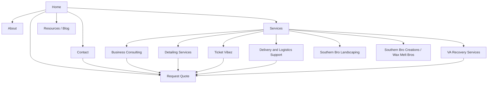

# Southern Bro Enterprises Website Rebuild Plan

## 1. Objective

Create a professional, conversion-focused website structure that:

- clearly explains the company and its service lines
- prioritizes business consulting, detailing, ticketing, and customer intake
- improves navigation and trust
- supports lead capture and HubSpot integration
- keeps lower-priority brands available without letting them dominate the homepage

## 2. Recommended Website Priorities

### High Priority

- Business Consulting
- Detailing Services
- Ticket Vibez / ticketing support
- Request Quote
- Contact / lead capture
- About Southern Bro Enterprises

### Medium Priority

- Delivery and logistics support
- VA Recovery Services / community programs
- Resources / blog

### Lower Priority for Current Economy

- Southern Bro Landscaping
- Southern Bro Creations / Wax Melt Bros

## 3. Recommended Sitemap

| Page | Purpose | Priority | Notes |
| --- | --- | --- | --- |
| Home | Introduce the company, key services, and main CTAs | High | Should push users toward Services and Request Quote |
| About | Explain the company story, mission, service area, and trust factors | High | Include leadership, values, and community focus |
| Services | Master overview page for all services | High | Organize by business line, not by cluttered flyer layout |
| Business Consulting | Dedicated service page for consulting support | High | Strong CTA to request a consultation |
| Detailing Services | Dedicated page for detailing offers and booking requests | High | Treat as current growth service |
| Ticket Vibez | Dedicated page for ticketing support and event promotions | High | Include audience and request CTA |
| Delivery and Logistics Support | Dedicated page for delivery, event support, and equipment transport | Medium | Keep available but below consulting and detailing |
| VA Recovery Services / Community Programs | Explain community aid, grant-related support, and service mission | Medium | Important for trust and social impact |
| Request Quote | Central conversion page for all service inquiries | High | Must connect to HubSpot |
| Contact | Direct contact page with phone, email, service area, and short inquiry form | High | Keep simple and mobile friendly |
| Resources / Blog | Publish updates, business tips, grant information, and service guides | Medium | Helps SEO and trust |
| Customer Portal | Optional future phase for documents, invoices, or status tracking | Low / Phase 2 | Only if needed after core pages are stable |
| Southern Bro Landscaping | Standalone brand page | Low | Keep live but reduce homepage emphasis |
| Southern Bro Creations / Wax Melt Bros | Standalone brand page | Low | Keep live but reduce homepage emphasis |

## 4. Recommended Navigation

### Primary Navigation

- Home
- About
- Services
- Request Quote
- Resources
- Contact

### Services Dropdown

- Business Consulting
- Detailing Services
- Ticket Vibez
- Delivery and Logistics Support
- VA Recovery Services
- Southern Bro Landscaping
- Southern Bro Creations / Wax Melt Bros

## 5. Sitemap Diagram

## 6. Homepage Structure

1. Hero section with logo, service area, and strong CTA
2. Short company overview
3. Featured high-priority services
4. Why choose Southern Bro Enterprises
5. How the quote / request process works
6. Community impact / VA Recovery highlight
7. Contact and final CTA

## 7. Content Rules for the Rebuild

- Keep each page focused on one main purpose.
- Use one main CTA per page.
- Write in plain language for local customers.
- Add trust signals such as service area, response time, testimonials, and community involvement.
- Use brand logos where relevant, but do not let graphics overpower readability.
- Design for mobile first because many users will likely visit from their phones.

## 8. SEO Structure

### Target Keyword Themes

- business consulting Lynchburg VA
- small business consulting Virginia
- detailing services Lynchburg VA
- event ticketing support Virginia
- logistics and delivery support Lynchburg
- community support programs Virginia
- request a quote Southern Bro Enterprises

### Sample Page Titles and Meta Descriptions

| Page | Suggested Title | Suggested Meta Description |
| --- | --- | --- |
| Home | Southern Bro Enterprises LLC \| Business Services, Detailing, Ticketing & Support | Southern Bro Enterprises provides business consulting, detailing, ticketing support, logistics, and community-focused services in Lynchburg, VA and across Virginia. |
| About | About Southern Bro Enterprises LLC \| Company Overview | Learn about Southern Bro Enterprises, our mission, service area, and the brands and services we manage across Virginia. |
| Services | Services \| Southern Bro Enterprises LLC | Explore consulting, detailing, ticketing, delivery support, community programs, and additional services from Southern Bro Enterprises. |
| Business Consulting | Business Consulting in Lynchburg, VA \| Southern Bro Enterprises | Get support with startup planning, operations, consulting, and business growth services from Southern Bro Enterprises. |
| Detailing Services | Detailing Services in Lynchburg, VA \| Southern Bro Enterprises | Request detailing services with a professional intake process, flexible scheduling, and local support. |
| Ticket Vibez | Ticket Vibez \| Event Ticketing Support and Promotions | Discover ticketing support, event access solutions, and promotional campaign services through Ticket Vibez. |
| Request Quote | Request a Quote \| Southern Bro Enterprises | Submit a quote request for consulting, detailing, ticketing, delivery, or other services from Southern Bro Enterprises. |
| Contact | Contact Southern Bro Enterprises LLC | Contact Southern Bro Enterprises by phone, email, or online form for service questions and quote requests. |

## 9. Recommended Rebuild Phases

### Phase 1: Immediate Rebuild

- Home
- About
- Services overview
- Business Consulting
- Detailing Services
- Ticket Vibez
- Request Quote
- Contact

### Phase 2: Growth and SEO

- Delivery and Logistics Support
- VA Recovery Services
- Resources / Blog
- HubSpot form automation
- Basic analytics and lead dashboards

### Phase 3: Secondary Brand Support

- Southern Bro Landscaping
- Southern Bro Creations / Wax Melt Bros
- Optional customer portal

## 10. Final Recommendation

The rebuild should be structured around the services most likely to generate leads now. The website should feel professional, clear, and organized around customer actions, not just around brand graphics. Consulting, detailing, ticketing, and quote capture should lead the user journey.
