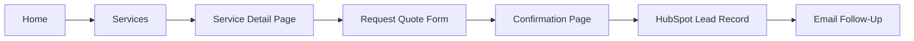
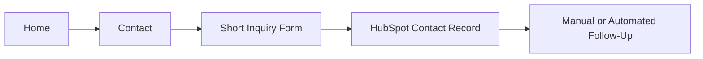
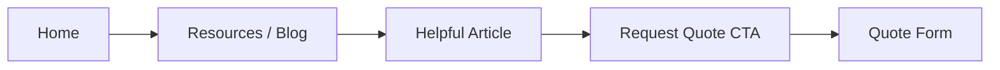

# Southern Bro Enterprises Website Flow Diagram

## 1. Primary Goal

Guide visitors from interest to inquiry with as few steps as possible.

## 2. Core Customer Flow

## 3. Alternate Contact Flow

## 4. Content Discovery Flow

## 5. Service-Specific Flow Examples

### Consulting

Home -> Services -> Business Consulting -> Request Consultation -> Confirmation

### Detailing

Home -> Services -> Detailing Services -> Request Quote -> Confirmation

### Ticket Vibez

Home -> Services -> Ticket Vibez -> Submit Event Support Request -> Confirmation

## 6. Recommended Confirmation Page Elements

- short success message
- expected response time
- phone number and email
- link back to services
- note confirming the inquiry was received

## 7. UX Recommendations

- Put the main CTA above the fold on every high-priority page.
- Keep the quote form short enough to complete on a phone.
- Avoid too many competing buttons on the homepage.
- Make the navigation simple and consistent across all pages.
- Use branded visuals, but always protect readability and button contrast.
