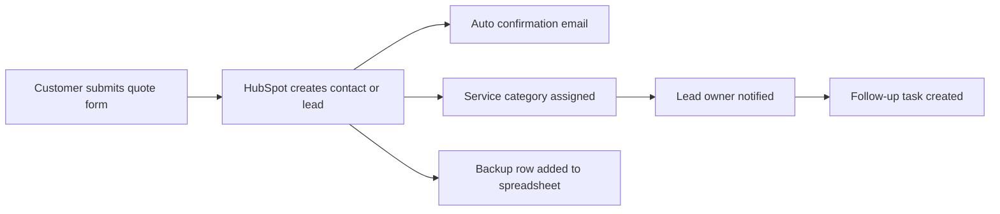

# Southern Bro Enterprises Automation Opportunities Report

## 1. Objective

Identify practical, low-cost automation ideas that can reduce manual work, improve response time, and keep customer inquiries organized while the company rebuilds its digital systems.

## 2. Recommended Automation Ideas

| # | Automation Idea | What It Does | Suggested Tools | Estimated Cost | Main Benefit | Priority |
| --- | --- | --- | --- | --- | --- | --- |
| 1 | Quote confirmation email | Sends an instant confirmation after a customer submits a request | HubSpot Forms, HubSpot email, or Zapier | $0 if current tools allow it | Improves trust and confirms receipt | High |
| 2 | Lead routing by service type | Sends consulting, detailing, ticketing, and other leads to the right owner or queue | HubSpot properties, HubSpot workflows, Make, Zapier | $0 to low monthly cost | Faster response and better organization | High |
| 3 | New lead notification | Alerts management by email when a new quote request arrives | HubSpot notifications, Zapier, Make | $0 to low monthly cost | No missed inquiries | High |
| 4 | Follow-up reminder workflow | Creates reminders if a lead has not been answered within 24 to 48 hours | HubSpot tasks, Notion, Zapier | $0 to low monthly cost | Improves close rate and accountability | High |
| 5 | Contact form backup logging | Copies every form submission into a spreadsheet or Airtable base for backup tracking | Google Sheets, Airtable, Zapier, Make | $0 to low monthly cost | Extra visibility during restoration period | Medium |
| 6 | Intake-to-onboarding email | Sends a welcome email after a prospect becomes a confirmed customer | HubSpot email, Mailchimp | $0 to low monthly cost | Better customer experience | Medium |
| 7 | Weekly lead summary | Sends a weekly list of new leads, open quotes, and pending follow-ups | HubSpot reports, Airtable, Notion, email automation | $0 to low monthly cost | Gives management a simple status report | Medium |
| 8 | Service request categorization | Uses form fields to automatically label each request by service line and urgency | HubSpot forms, required fields, Make | $0 to low monthly cost | Cleaner pipeline management | Medium |
| 9 | Resource download follow-up | When someone downloads a guide or fills out a blog form, send a nurturing email sequence | HubSpot or Mailchimp | $0 to low monthly cost | Supports lead generation | Medium |
| 10 | Appointment request pre-screening | Collects service details up front before staff contact the customer | HubSpot form, Google Forms, Airtable | $0 | Saves time on back-and-forth communication | High |

## 3. Best Immediate Automations to Implement First

1. Quote confirmation email
2. New lead notification
3. Lead routing by service type
4. Follow-up reminder workflow
5. Backup logging into a spreadsheet

## 4. Recommended Tool Stack

### Primary System of Record

- HubSpot

### Low-Cost Automation Helpers

- Zapier
- Make
- Google Sheets
- Airtable
- Notion
- Mailchimp

## 5. Suggested First Workflow

## 6. Cost Notes

- HubSpot offers free CRM tools and form support.
- Zapier offers a free tier and paid plans starting at a low monthly range.
- Make offers a free plan and low-cost paid plans.
- Notion has a free plan and paid workspace upgrades.
- Mailchimp offers a free plan and paid email marketing tiers.

All paid activations should be approved by management before any trial or subscription is started.

## 7. Sources

- HubSpot pricing: https://www.hubspot.com/pricing
- HubSpot forms: https://www.hubspot.com/products/marketing/forms
- Zapier pricing: https://zapier.com/pricing
- Make pricing: https://www.make.com/en/pricing
- Notion pricing: https://www.notion.so/pricing
- Airtable pricing: https://www.airtable.com/pricing
- Mailchimp pricing: https://mailchimp.com/pricing/marketing/
