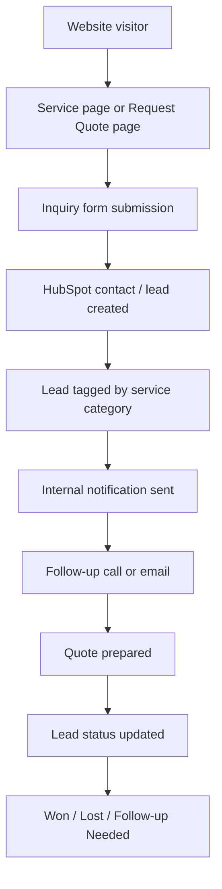

# Southern Bro Enterprises Lead Generation System Design

## 1. Goal

Build a simple lead generation and tracking process that captures customer inquiries, routes them into HubSpot, and gives management a clear view of follow-up status.

## 2. Recommended Lead Capture Stack

### Primary

- HubSpot forms
- HubSpot CRM

### Backup / Support Tools

- Google Forms for temporary backup intake if the website is down
- Google Sheets or Airtable for a secondary lead tracker
- Mailchimp for future nurture campaigns if needed

## 3. Recommended Inquiry Form Fields

- Full name
- Business name or organization
- Email
- Phone number
- Service interest
- Service location
- Budget range
- Preferred timeline
- Brief project description
- Best time to contact
- Referral source

## 4. Lead Workflow Diagram

## 5. Suggested Lead Status Pipeline

1. New
2. Contacted
3. Qualified
4. Quote in Progress
5. Quote Sent
6. Awaiting Response
7. Won
8. Lost

## 6. Recommended Follow-Up Standards

- New inquiries should be acknowledged immediately by email.
- High-priority leads should receive a human response within 24 hours.
- Quote requests should be categorized by service type.
- Every lead should have a next action date.
- A weekly review should identify stale leads with no follow-up.

## 7. Lead Capture Strategy Recommendations

### Website

- Add `Request Quote` buttons on all high-priority pages.
- Use one main intake form with a required service-category field.
- Keep form length moderate so users do not abandon it.

### Content and SEO

- Use service pages and blog posts to attract search traffic.
- Add CTA buttons inside service and resource pages.

### Referral and Community Channels

- Use QR codes, flyers, and event materials that link back to the quote form.
- Track referral source inside the inquiry form.

## 8. Reporting Recommendations

Each week, management should be able to review:

- number of new leads
- leads by service type
- open quotes
- average response time
- leads won vs. lost

## 9. Attached Template

Use `lead-tracker-template.csv` as a simple backup system until all tracking is fully organized in HubSpot.

## 10. Sources

- HubSpot forms: https://www.hubspot.com/products/marketing/forms
- HubSpot CRM: https://www.hubspot.com/products/crm
- Airtable pricing: https://www.airtable.com/pricing
- Mailchimp pricing: https://mailchimp.com/pricing/marketing/
