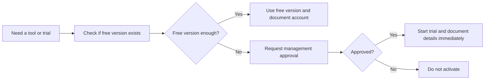

# Free Trial Usage Policy and Account Documentation

## 1. Purpose

Because company finances are currently restricted, all software research and testing should follow a strict low-cost approval process.

## 2. Policy Rules

1. Use free versions first whenever possible.
2. Do not activate a paid subscription without management approval.
3. If a free trial requires a credit card, obtain approval before starting the trial.
4. If a company card is used for activation, it should be used only with approval and for the trial purpose described.
5. All created accounts must be documented and shared with management immediately.

## 3. Required Documentation for Every Account

- platform name
- website URL
- login email
- password
- trial expiration date
- purpose of the account
- approved by
- notes

Use `account-trial-register-template.csv` to store this information.

## 4. Approval Workflow

## 5. Recommended Management Practice

- review the account register daily or weekly
- keep copies of all account credentials in a secure shared location
- cancel unused trials before renewal dates
- remove duplicate tools to avoid confusion

## 6. Final Note

This policy protects the company from accidental charges, lost access, and undocumented trial accounts during the recovery period.
